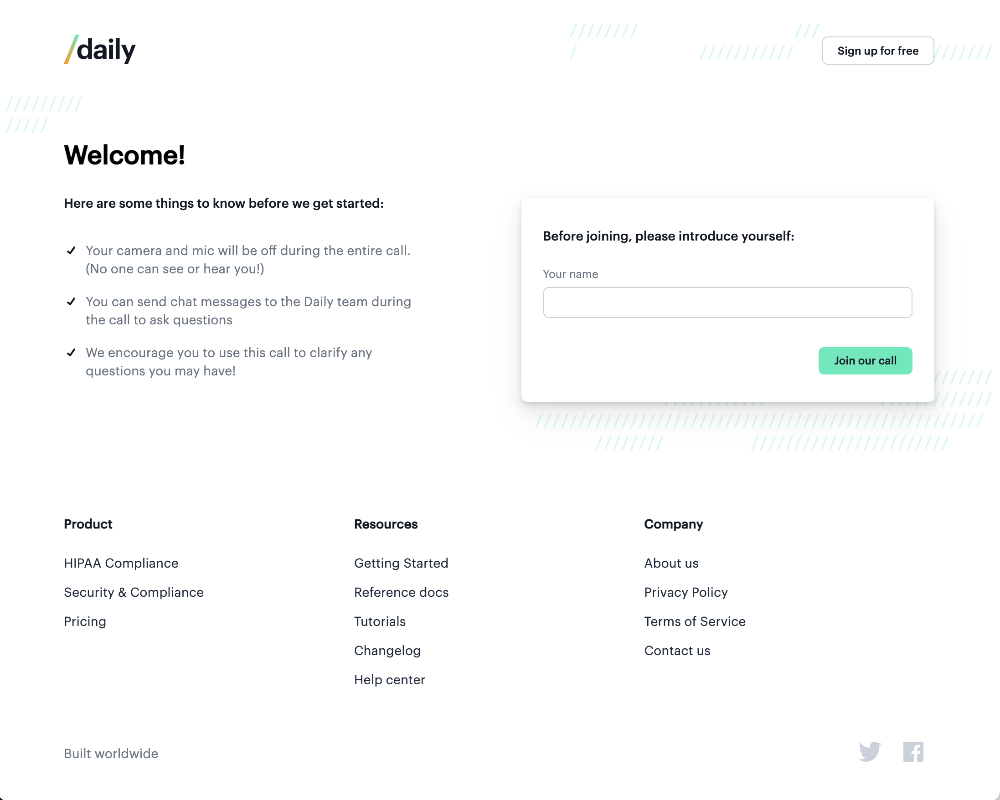
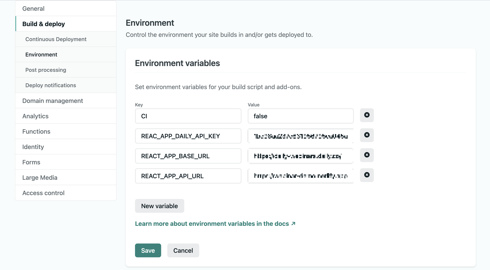
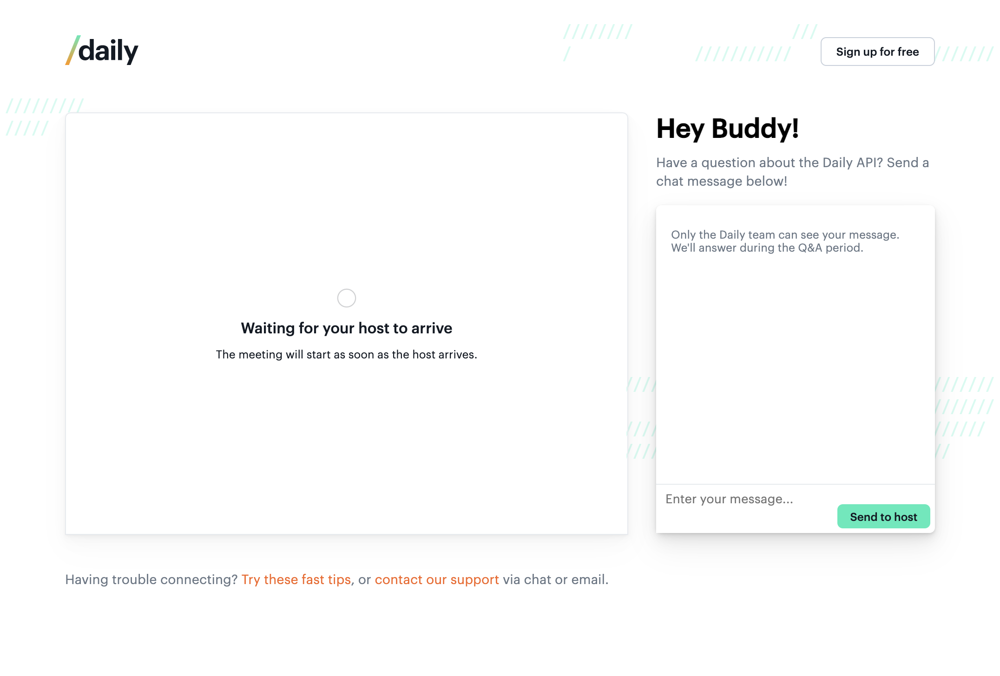

# Daily webinar app

Daily's webinar app example using [Daily Prebuilt](https://www.daily.co/prebuilt).



## Getting started

### Deploying to Netlify

There are a couple endpoints used in this repo to validate Daily meeting tokens and rooms. To avoid having to deploy your own API, this repo "self-hosts" the endpoints it uses via Netlify.

_Note: You can skip this step if you prefer to use your own server for the Daily meeting tokens and rooms endpoints._

You will need to set three environment variables in Netlify and locally in an `.env` file (if you're testing locally):

```
REACT_APP_BASE_URL=<-your Daily URL->
REACT_APP_DAILY_API_KEY=<-your Daily API key->
REACT_APP_NETLIFY_URL=<Netlify-URL-available-after-deploying>
```

To get your `REACT_APP_NETLIFY_URL` for the environment variables, deploy your copy of this repo in Netlify. It should look something like `https://example-domain.netlify.app/`

We've included a button below to deploy with one click:

[](https://app.netlify.com/start/deploy?repository=https://github.com/daily-demos/webinar)

Once deployed, make sure your environment variables are updated in `Site Settings > Build & deploy`.



_Note: you will need to redeploy the app in Netlify after changing any environment variables in the settings._

### Creating a Daily account

To get the other two values for your environment, create a Daily account at [https://dashboard.daily.co/signup](https://dashboard.daily.co/signup). Your API key will be available under the `Developers` tab. Your "base URL" can be the domain you chose when you set up your account (e.g. `https://webinar-demo.daily.co`).

Make sure you have a `.gitignore` file that includes `.env` and add a `.env` file with the following keys:

### Running locally

To use this demo locally, run the following commands in your terminal:

```
yarn
yarn start
```

This will run the app in the development mode.
Open [http://localhost:3000](http://localhost:3000) to view it in the browser.



To join a webinar room, [create a Daily room](https://dashboard.daily.co/rooms/create) and go to [http://localhost:3000/[room-name]](http://localhost:3000/[room-name]) with `[room-name]` updated with the room name you just created.

### Room properties

There are two main room properties to be aware of when creating a Daily room for your webinar:

```
properties: {
    enable_chat: false,
    owner_only_broadcast: true
}
```

Since the webinar app has a custom chat, the Daily Prebuilt chat should be turned off. Additionally, to ensure only the meeting owners can turn on their cameras/microphones for the webinar experience, set the `owner_only_broadcast` property to `true`.

There are several other optional properties depending on the webinar experience you're building. Additional information on [room properties](https://docs.daily.co/reference#create-room) are included in Daily's docs.

---

## Features:

- one:many presentation mode for the room admin
- participants (non-admin) can message the admin directly
- admin can respond to individual participants or message the entire group
- lots of Daily links to help participants find what they need in our documentation

## Host vs. attendee

To be a host, [create a meeting token for the room](https://docs.daily.co/reference#create-meeting-token) and join with the token appended to the URL.
Example:
`http://localhost:3000/[room-name]?t=[token]`

To be an attendee, go to the same URL but don't include the token.
Example:
`http://localhost:3000/[room-name]`
