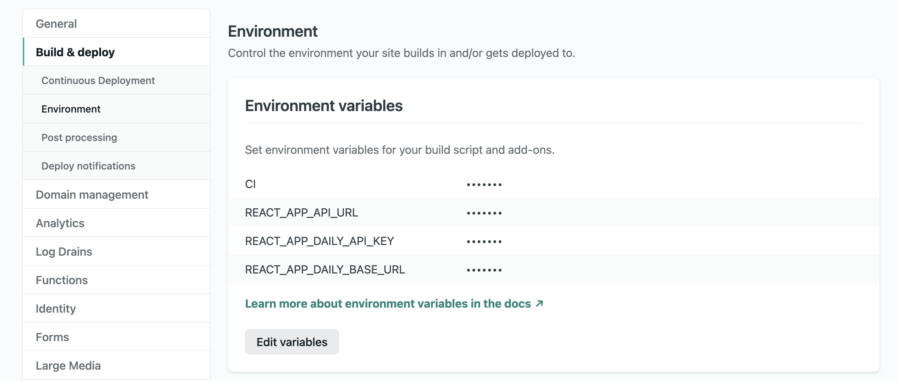

# Daily webinar app

Daily's webinar app example using [Daily Prebuilt](https://www.daily.co/prebuilt).


## Requirements

[Sign up for a Daily account](https://dashboard.daily.co/signup). You will need your Daily API key, which can be found on the [Developers](https://dashboard.daily.co/developers) page.

### Create a Daily room

Your Daily room is where the webinar will be hosted. You will need to create a Daily room with the specific properties outlined below.

### Room properties

There are two main room properties to be aware of when creating a Daily room for your webinar:

```
properties: {
    "enable_chat": false,
    "owner_only_broadcast": true
}
```

You can create a new room via the [Dashboard](https://dashboard.daily.co/rooms/create) or the [Daily REST API](https://docs.daily.co/reference/rest-api/rooms/create-room).

To create a room via a cURL command, update and use the following command (don't forget to set your API key):

```bash
curl --request POST \
 --url https://api.daily.co/v1/rooms \
 --header 'Authorization: Bearer <YOUR-DAILY-API-KEY>' \
 --header 'Content-Type: application/json' \
 --data '{"properties":{"enable_chat":false,"owner_only_broadcast":true},"name":"ROOM_NAME"}'
```

Let's review why these properties are important:

Since the webinar app has a custom chat, the Daily Prebuilt's default chat functionality should be turned off. Otherwise, you'd have two chat widgets available to participants at the same time.

Additionally, to ensure only the meeting owners can turn on their cameras/microphones for the webinar experience, set the `owner_only_broadcast` property to `true`. If this setting is not used, anyone could turn on their devices and the custom chat will not work as expected. (One admin must be present for the chat to work.)

There are several other optional properties depending on the webinar experience you're building. Additional information on [room properties](https://docs.daily.co/reference#create-room) is available in the Daily docs.

---

### Admins vs. attendees

There are two types of call participants in this webinar app:

- Admins
- Attendees

To join as an admin, you will need a [Daily meeting token](https://docs.daily.co/reference/rest-api/meeting-tokens/create-meeting-token) with the following values:

```
properties: {
    "is_owner": true,
    "room_name": "ROOM_NAME",
    "user_name": "USER_NAME"
}
```

To create a meeting token via a cURL command, update and use the following command (don't forget to set your API key and the specific values you'd like to use):

```bash
curl --request POST \
 --url https://api.daily.co/v1/meeting-tokens \
 --header 'Authorization: Bearer <YOUR-DAILY-API-KEY>' \
 --header 'Content-Type: application/json' \
 --data '{"properties":{"is_owner":"true","user_name":"USER_NAME","room_name":"ROOM_NAME"}}'
```

Steps to join as an admin with your token are outlined below.

Attendees do not need a token to join. Further instructions for running the app and joining as an attendee are included below.

---

## Running this demo locally

To run this demo locally, add an `.env` file with the following variables:

```
REACT_APP_DAILY_BASE_URL=<-your Daily URL, e.g. https://demo-example.daily.co/->
REACT_APP_DAILY_API_KEY=<-your Daily API key->
REACT_APP_ROOM_ENDPOINT=local
```

_Note: there is a `.env.sample` file that can be renamed with the variable names already included._

Next, in a terminal window, run the following commands:

```
yarn
yarn start
```

Open [http://localhost:3000](http://localhost:3000) to view it in the browser.

_In-call attendee view_

To join a webinar room as an attendee, go to `http://localhost:3000/[room-name]` where `[room-name]` is changed to the name of the room you just created.

To join as a webinar admin, go to `http://localhost:3000/[room-name]?t=[daily-token]`, using the [Daily meeting token](https://docs.daily.co/reference#create-meeting-token) you just created in place of `[daily-token]`.

---

## Deploying this demo to Netlify

We've included a button below to deploy to Netlify with one click:

[](https://app.netlify.com/start/deploy?repository=https://github.com/daily-demos/webinar)

For this demo to work remotely, you will need to update the Netlify settings.

### Updating Netlify settings

There are a couple Daily API endpoints used in this repo to validate Daily meeting tokens and rooms. We have set up a `netlify.toml` file to handle [Netlify redirects](https://docs.netlify.com/configure-builds/file-based-configuration/#redirects) to simplify interacting with these endpoints. This allows the Daily endpoints to be used without using them (and your API key) directly in this client-side code.



Once deployed, You will need to set three environment variables in Netlify's console under `Site Settings > Build & deploy`:

```
REACT_APP_DAILY_BASE_URL=<-your Daily URL->
REACT_APP_DAILY_API_KEY=<-your Daily API key->
REACT_APP_NETLIFY_URL=<Netlify-URL-available-after-deploying>
```

Your `REACT_APP_NETLIFY_URL` variable is the URL where Netlify deployed your copy of the app. It should look something like `https://example-domain.netlify.app/`.

The other two variables are the same as what's used when running the app locally:

- Your Daily developer key found on the Daily dashboard [Developers](https://dashboard.daily.co/developers) page
- Your Daily base URL (e.g. https://demo-example.daily.co)

_Note: You will need to redeploy the app in Netlify after changing any environment variables in the settings._

Once the app is redeployed, you can visit your Netlify domain to see the deployed version `https://example-domain.netlify.app/[room-name]`

---

## Demo Features:

- one:many presentation mode for the room admin
- participants (non-admin) can message the admin directly
- admin can respond to individual participants or message the entire group
- lots of Daily links to help participants find what they need in our documentation

---

## Related blog posts/tutorials

Learn more about this demo on the [Daily blog](https://www.daily.co/blog/tag/webinar/).

- [Introduction to the webinar series and demo specs](https://www.daily.co/blog/webinartc-building-a-webinar-app-with-react-and-daily-prebuilt-ui/)
- [Adding Daily Prebuilt to our webinar demo](https://www.daily.co/blog/webinartc-build-your-own-webinar-app/)
- [Distinguish between webinar admins and attendees in your webinar app](https://www.daily.co/blog/create-admins-in-react-apps-with-daily-meeting-tokens/)
- [Create a custom chat input for your webinar app](https://www.daily.co/blog/build-a-react-input-with-sendappmessage/)
- [Understanding Daily room settings for broadcast (webinar) calls](https://www.daily.co/blog/daily-prebuilt-broadcast-call-deep-dive/)
- [Build a React form to generate Daily meeting tokens for webinar admins](https://www.daily.co/blog/build-a-react-form-to-generate-daily-meeting-tokens/)
